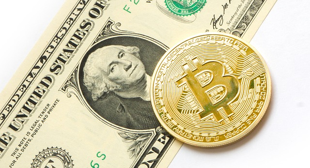

TL;DR--Blockchain technology is underrated in the long term, even if it was overrated in late 2017. Not only do tangible, real world use cases exist today but also blockchain's utility will compound exponentially as time progresses. Skeptics are either ignorant of developments in this space or lack insight into the implications of decentralized, programmable, open source data and money. Either way, they're all wrong.

--

Blockchain technology has come under scrutiny recently as naysayers have piled on with criticism. Some claim that [Ten Years In No One Has Come Up With a Good Use Case For Blockchain](https://hackernoon.com/ten-years-in-nobody-has-come-up-with-a-use-case-for-blockchain-ee98c180100) or that [A Blockchain Is a Specific Set of Choices With a Narrow Set of Use Cases](https://news.ycombinator.com/item?id=16897994). Even in tech-friendly circles like Hacker News or TechCrunch, it has become *en vogue* to deride blockchain as some sort of inferior database-like technology for which a good PostgresQL cluster would more than suffice.

On the other hand, there are proponents of blockchain who boldly proclaim that the technology will revolutionize finance, transform nations and destroy central banks without being able to articulate how or why we might want that in the first place (uhh, I just wanted to buy useless crap on Amazon and MasterCard works just fine for that, thank you).

### How Long Will It Take

A lot of people are impatient, skeptics and enthusiasts alike. One group is waiting for crypto to crash to zero while the other is wondering why the revolution hasn't happened yet. 

A lot of people forget that we have a pretty mature financial system that has evolved over the last couple hundred years. It's not perfect, it's full of "technical debt" (a term used to describe the liability of maintaining complex legacy systems), but by and large the system works fairly well for the average American or first world citizen. Trillions of dollars move hands every day, albeit slowly and under the careful scrutiny of Big Brother.

ile the first commercial cell phone launched in 1983, it would take another 20 years before they really started to go mainstream. I used to sell cell phones in the early 00's. It was difficult to convince some people they would ever use a cell phone for anything more than emergencies. 